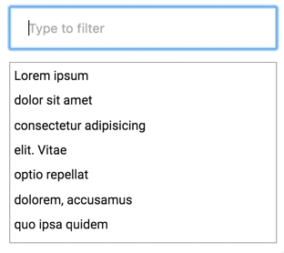

[](https://badge.fury.io/gh/thirabrtnk%2Ffilterany) [](https://codeclimate.com/github/ThiRaBrTNK/filterany)
# FilterAny

FilterAny is a JS module to filter content by user input



[**Live demo**](https://thirabrtnk.github.io/filterany/)

## Why yet-another-filter-module?

- **Really fast**: Built to gain max performance
- **Match highlighting**: with appropriate `<mark>` element
- **Lightweight**: ~1.3Kb minified and gzipped
- **No dependencies**: Vanilla JS and nothing more
- **Module for anything**: AMD/CommonJS/Nothing

## TODO

- 'No results' message
- Fuzzy search

## Installation

You can install FilterAny by using [bower](http://bower.io):
```
bower install --save filterany
```
Or you can just download [filterany.js](https://raw.githubusercontent.com/ThiRaBrTNK/filterany/master/filterany.js)

## Usage

Usage depends on what tools do you use in your project. In the simplest case if you downloaded the library with Bower, you can include it as following:                                    
```html
<script src="bower_components/filterany/filterany.js"></script>
```
If you use some AMD/CommonJS module loader, refer to it's manual.
After all you should be able to create instance of FilterAny like that:
```js
var filterable = document.querySelector('.filterable');
var filter = new FilterAny(filterable);
```

## API

### new FilterAny(element, [options])

Creates new instance of FilterAny. `element` is a DOM Node, which includes input element and all filterable elements.
Options is a [settings object](#options)

### Instance methods

#### FilterAny.init()

Initializes instance. Run automatically on instance creation.

#### FilterAny.search(query)

Runs search of query in given instance, where `query` is of type `String`.

#### FilterAny.onInput()

Returns the handler of `input` event, fired on the search input.

#### FilterAny.onReset()

Returns the handler of `reset` event, fired on the `form`, assosiated with search input.

## Options

FilterAny has the following options:

### `debounceTimeout`

* Default: `200`
* Type: `Number`

Time to wait for the following event after input event fired before running filtering. Use `0` for instant filtering as-user-types.

### `highlightedClass`

* Default: `'filter-highlighted'`
* Type: `String`

Class to add on `<mark>` element, which highlights matches.

### `inputSelector`

* Deafult: `'input[type=search]'`
* Type: `String`

Selector for search input within FilterAny element.

### `itemContainerSelector`

* Deafult: `'ul'`
* Type: `String`

Selector for container of items. One FilterAny instance can have few of them.

### `itemSelector`

* Deafult: `'li'`
* Type: `String`

Selector for one filterable item. Item will be hidden entirely if it doesn't match filtering.

### `itemTextSelector`

* Deafult: `''`
* Type: `String`

Selector for element containing only text within item. Should be empty, if item itselfs contains only text.
If there is no one element containing only text, matches highlighting won't work.

### `onSearch(itemsFound)`

* Deafult: `function() {}`
* Type: `Function`

Callback function to be run after filtering is done. Receives array of matching elements.
